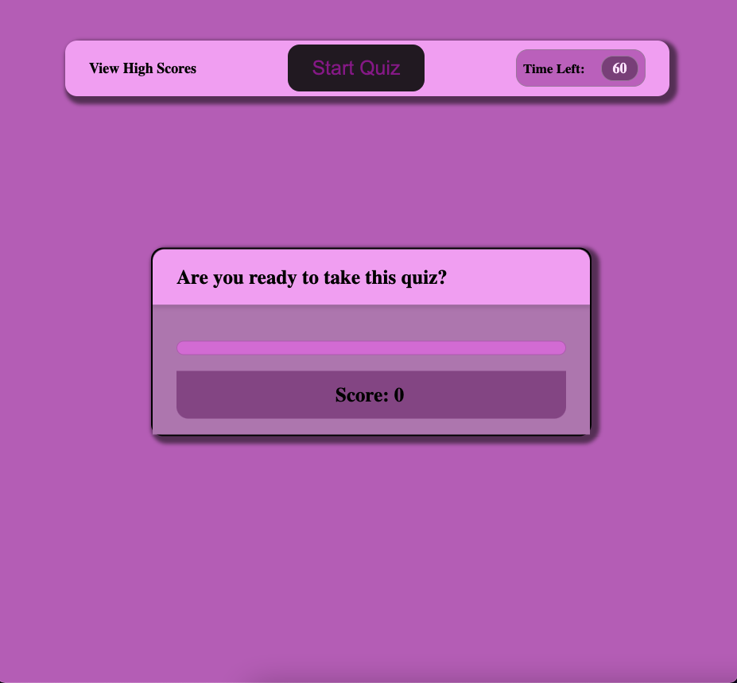
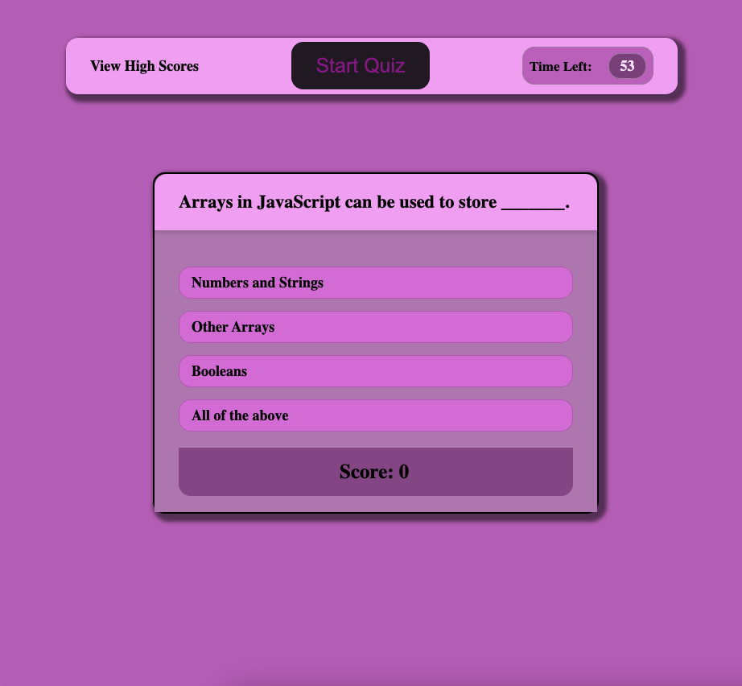
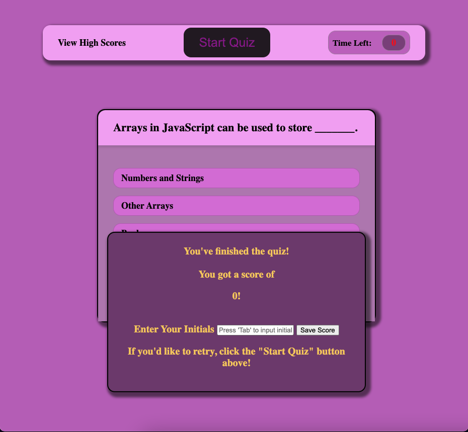

# code-quiz

## Purpose 
An online quiz that tests your knowledge about JavaScript functionality and syntax!

## Built With 
* HTML 
* CSS 
* JavaScript 

## Website 

## Github Repository Link 

## Current Bugs:
* When showResults() is called, the input field + Save Score button are not able to be clicked, despite having a z-index of 999. --- That means that saving and trying to view high scores does not work. 

## Images 

